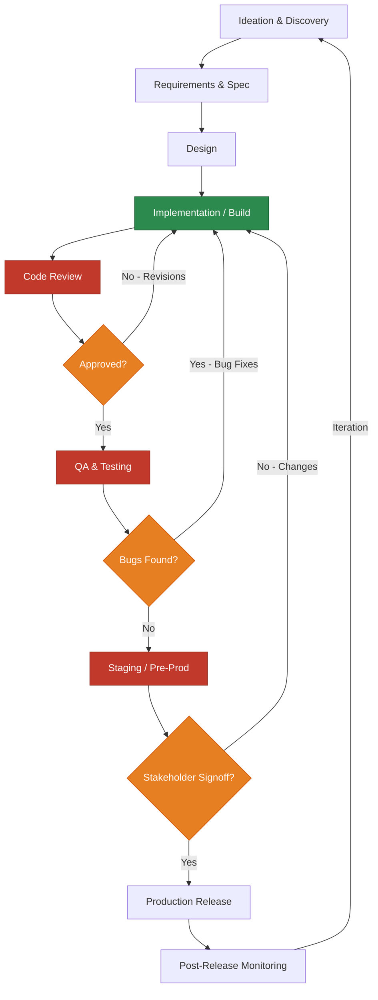
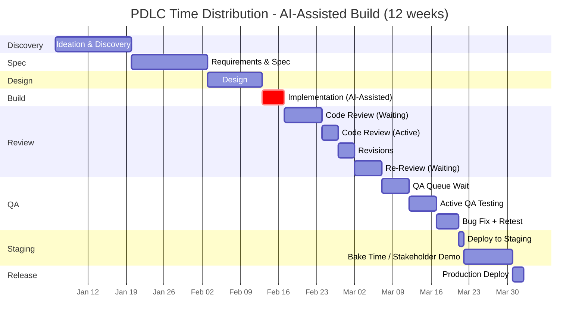
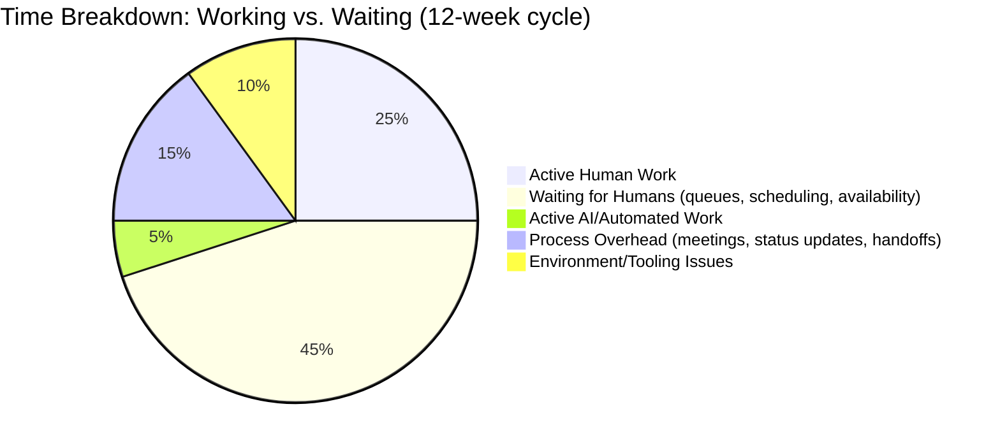
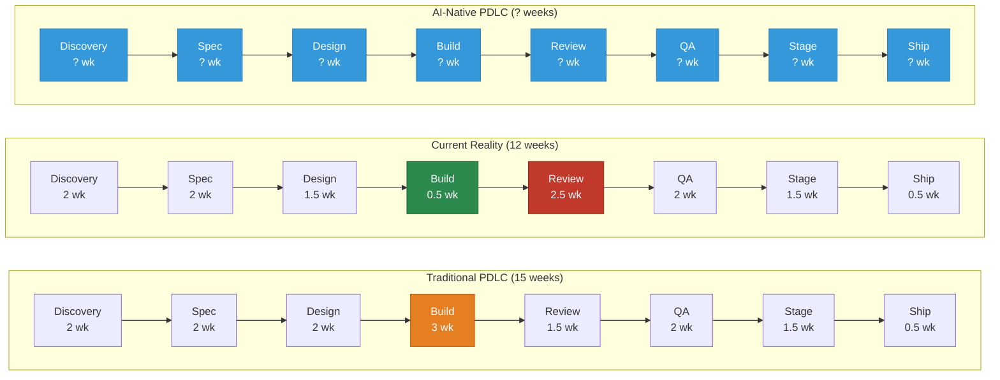

# PDLC Mermaid Charts

## Chart 1: Standard PDLC Flow (Sequential Reality)

Shows the actual flow including feedback loops and gates that create delays.

**Legend:**
- Green = AI-accelerated (fast)
- Red = Human-gated bottlenecks (slow)
- Orange = Decision gates (wait time)

---

## Chart 2: PDLC with Time Proportions (AI-Assisted Build)

Shows where time actually goes when build is AI-accelerated.

---

## Chart 3: Where Humans Wait vs. Where Humans Work

---

## Chart 4: The Compression Problem

What happens when build collapses but nothing else changes.

---

## Chart 5: Sequential Gates vs. Parallel Possibilities

```mermaid
flowchart TD
    subgraph today ["Today: Sequential Gates"]
        direction LR
        S1[Build] --> S2[PR Created]
        S2 --> S3[Wait for<br/>Reviewer 1]
        S3 --> S4[Wait for<br/>Reviewer 2]
        S4 --> S5[Wait for<br/>Reviewer 3]
        S5 --> S6[Revisions]
        S6 --> S7[Re-review]
        S7 --> S8[QA Queue]
        S8 --> S9[QA Test]
        S9 --> S10[Stage Queue]
        S10 --> S11[Bake]
        S11 --> S12[Ship]
    end

    subgraph future ["Possible: Parallel + AI Gates"]
        direction LR
        P1[Build] --> P2[PR Created]
        P2 --> P3[AI Pre-Review<br/>Instant]
        P3 --> P4[AI Test Suite<br/>Runs Parallel]
        P3 --> P5[Human Review<br/>1 Reviewer]
        P4 --> P6[Auto-Stage<br/>if Green]
        P5 --> P6
        P6 --> P7[AI Monitoring<br/>Auto-Rollback]
        P7 --> P8[Ship]
    end

    style S3 fill:#c0392b,stroke:#922b21,color:#fff
    style S4 fill:#c0392b,stroke:#922b21,color:#fff
    style S5 fill:#c0392b,stroke:#922b21,color:#fff
    style S8 fill:#c0392b,stroke:#922b21,color:#fff
    style S10 fill:#c0392b,stroke:#922b21,color:#fff
    style P3 fill:#2d8a4e,stroke:#1a5c33,color:#fff
    style P4 fill:#2d8a4e,stroke:#1a5c33,color:#fff
    style P7 fill:#2d8a4e,stroke:#1a5c33,color:#fff
```

---

## How to Render These Charts

These charts use [Mermaid](https://mermaid.js.org/) syntax. They render natively in:
- GitHub markdown (README, issues, PRs)
- VS Code with Mermaid extensions
- Notion (with Mermaid block)
- [Mermaid Live Editor](https://mermaid.live/) for quick previews and PNG/SVG export

For presentations, use the live editor to export as SVG/PNG.
